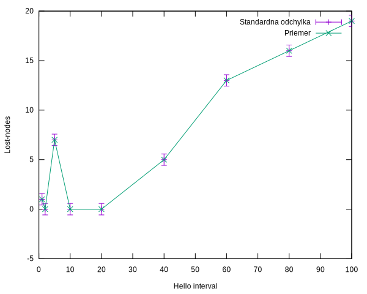
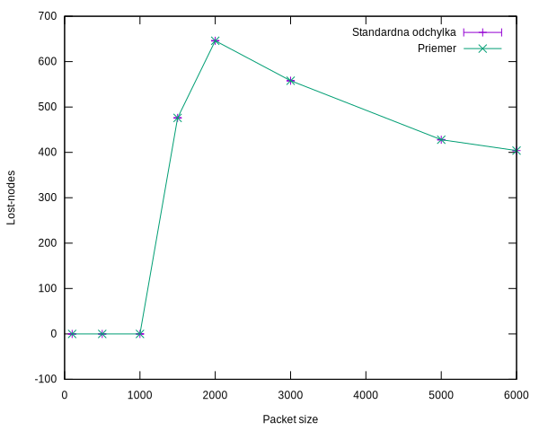
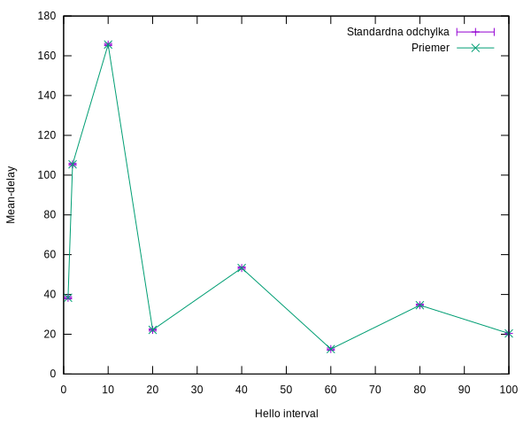

# PS2 - ZADANIE

## Pokyny k odovzdaniu

Odovzdajte projekt t.j. c++ kod so vsetkymi kniznicami ak boli navyse (napr. *.h alebo *.cc) popripade aj so spustacimi subormi bash, alebo gnuplot konfiguratorom ak ho projekt nevytvara.

Parametre nutne k spusteniu simulacie z prikazoveho riadka s jednotlivymi nazvami: 

- --simulTime -> cas trvania simulacie [double]
- --anim ->vytvorenie animacie [boolean]
- --helloInterval -> Interval hello paketov (OLSR)
- --uavSpeed ->pociatocna rychlost pohybu uzlov
- --distance -> vzdialenost medzi uzlami
- --pktSize -> velkost paketov na vymienanie telemetriky

Priklad spustenia simulacie z prikazoveho riadka:
>./waf --run "zadanie --anim=true --helloInterval=2 --pktSize=600 --distance=400"

## Dokumentacia zaverecneho zadania

Zadanie simuluje drony hladajuce loziska poziaru v Australskych lesoch. Hliadkujuce drony su na zaciatku simulacie rozmiestene do grid usporiadania. Vsetky drony maju spociatku nastaveny nahodny pohyb v okoli ich pociatocnej polohy. V pripade, ako dron najde podozrivu oblast (oblast s moznym vyskytom poziaru), privolava svojich najblizsich susedov zo svojho okolia k sebe. Hliadkujuce drony si taktiez vymienaju telemetricke udaje vo forme zostavajucej baterie, ktorej hodnotu posielaju svojim susedom. V zadani je taktiez implementovany vlastny broadcast protokol, pre odosielanie udajov vsetkym uzlom.

Implementacia vlastneho broadcast protokolu
- Pomocou OLSR routovacej tabulky si vyhladame susedov, ktory su klasifikovany vo vzdalenosti 1 hopu.
- Format datoveho paketu:
	* cislo_odosielajuceho_uzlu:cislo_spravy:data 
- Obsah datoveho paketu:
  * cislo_odosielajuceho_uzlu: ID daneho uzlu, ktory vyslal danu spravu
  * cislo_spravy: poradove cislo danej spravy pre dany node
  * data: uzitocne data - v pripade nami sledovanej telemetrie sa jedna o uroven baterie
- Protokol:
  * kazdy node si drzi posledne ID spravy, ktoru prijal od jednotlivych uzlov
  * ak prijmem spravu, ktorej ID je vacsie ako posledne zname ID, spracujem data a preposieam vsetkym mojim susedom
  * ak je ID danej spravy mensie alebo rovnake ako aktualne, dana sprava je zahodena, pretoze prisla od ineho nodu, ktoremu som danu spravu poslal ja
## Body zadania

#### Vizualizacia NetAnim (2b) + Reprezentacia merania (3b+2b)
 - Vizualizácia: NetAnim 2b (pozn. využite cmd-line-arguments)
 - --anim=true
 - Reprezentácia merania: Tri grafy (pozn. minimálne 10 bodov merania s vyhodnotením, t.j. odchýlky merania) 3b + zhodnotenie grafu (prečo je to taká závislosť) 2b
#### Graf c. 1: **LostNodesHello** [pocet/ms-1]
 - Popis: Zavislost poctu uzlov, ktore nemaju pocas simulacie ziadnych susedov od intervalu hello paketov. Sluzi ako nastavenie optimalnej hodnoty pre nas pripad.
 
    
#### Graf c. 2: **LostNodesPaketSize** [ms/m]
 - Popis: Zavislost poctu nodov, ktore nemaju pocas simulacie ziadnych susedov od velkosti paketov. Moze predstavovat optimalizaciu prenosovej velkosti udajov.
  
#### Graf c. 3: **MeanDelayHelloInterval** [ms/B]
 - Popis: Zavislost priemerneho oneskorenia dat v sieti od intervalu hello paketov. Sluzi na nastavenie intervalu hello paketov, kde mozme optimalizovat pomer stratenych nodov (Graf c. 1) a priemerneho oneskorenia dat, ktore vznika castejsim posielanim hello paketov.
 
   
#### Vhodny vyber ISO OSI (4b)
_Smerovaci protokol_:

***OLSR***:
- Nas pripad pouzitia vyzaduje vysoku mobilitu uzlov v sieti (kde je vhodnejsie pouzit OLSR protokol) a proaktivny pristup k vyhladavaniu trasy v sieti.
- Vyhladanie cesty medzi uzlami pri pouziti AODV trva dlhsie, ako pri OLSR -> nas pripad pouzitia vyzaduje rychlu komunikaciu, s vzdy aktualnou informaciou o topologii siete 
- OLSR -> okamzite najdenie cesty pomocou smerovacej tabulky, AODV-> inicializacia procesu objavenia trasy zahlcuje siet
- Nove trasy dokaze OLSR protokol zistit ihned po nahlaseni prerusenia povodnej trasy (narozdiel od AODV protokolu)
- Pri OLSR je oneskorenie prenosu paketu v sieti relativne male, v porovnani s rout request protokolom (ako napr AODV) 

_Transformny protokol_:

***UDP***:
- pointou nasho systemu je vymienanie informacii medzi vsetkymi uzlami v sieti  (broadcast), resp. medzi najblizsimi susedmi
- z tohto dovodu je v nasom systeme vhodne (miestami az nutne) pouzit UDP, taktiez pozadujeme rychlost prenosu, bez nutnosti potvrdenia o prijati odoslanych paketov (nakolko odosielame viacerym uzlom)
- Neaktualnu spravu je v nasom pripade mozne zahodit

#### Volanie casovych udalosti  (2b)

- Simulator::Schedule(Seconds (30.0), &SendDataToNeighbours, node_cont.Get(6), "testovacia sprava");
 - Odoslanie textu "testovacia sprava" vsetkym dostupnym uzlom
- Simulator::Schedule(Seconds (61.0), &SendDataToNeighbours, node_cont.Get(17), "testovacia sprava2");
 - Odoslanie textu "testovacia sprava2" vsetkym dostupnym uzlom
- Simulator::Schedule(Seconds (80.0), &CallNeighbours, node_cont.Get(16));
 - Uzol s cislom 16 privolava vsetkych svojich susedov
 
#### Zmena v  L1  fyzicke medium, pohyb, utlm … (3b) + Volanie udalosti zmeny stavu (atributu modelu) (2b)
- Simulator::Schedule(Seconds (45.0), &CallNeighbours, node_cont.Get(11));
 - Funkcia CallNeighbours privolava vsetkych susednych dronov. Toto privolanie je konstruovane tak, ze sa zisti uhol natocenia daneho dronu k jeho cielu, ten sa nastavi v MobilityModel-y a uda sa mu nejaka konstantna rychlost vypocitanym smerom. Vypocitame kedy je dany node potrebne zastavit a nasledne mu zmenime MobilityModel na nahodny pohyb v okoli.

#### Zmena v  L2-L5 (2b)
- Simulator::Schedule (Seconds (sym_time/4), &Config::Set, "/NodeList/*/$ns3::olsr::RoutingProtocol/HelloInterval", TimeValue(Seconds(helloInterval)));
  - Nastava zmena intervalu Hello Paketov
